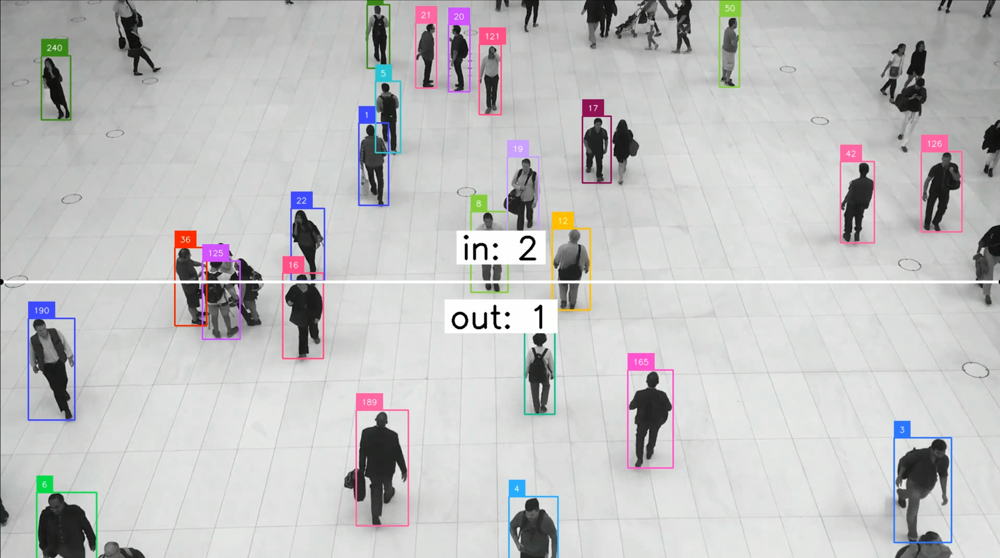

# Count Objects Crossing the Line

[](demo.mp4)

This example demonstrate the power of `trolo` using object detection to count object on a video, along with line zone counting functionality. It uses a pretained model for detection and provides an annotated output video with detected objects, tracking IDs, and counts of objects crossing a defined line zone. 

## Features
- **Object Detection**: Detect objects in video frames using a specified detection model.
- **Object Tracking**: Tracks detected objects across video frames using the `ByteTrack` tracker from `supervision`
- **Line Zone Counting**: Counts the number of objects crossing a predefined line in the video from `supervision`

## Installation:

-  Setup python environment and activate it [optional]
	 ```shell
	python3 -m venv venv
	source venv/bin/activate
	```	
- Install required dependencies
	```shell
	pip install supervision
	```

## How It Works
1. The script loads a detection model using `DetectionPredictor` from `trolo`
2. It reads video frames from the input video file.
3. Each frame is processed to:
   - Detect objects based on the specified confidence threshold.
   - Track objects across frames.
   - Annotate the frame with bounding boxes, labels, traces, and line zone information.
4. The processed frames are either visualized in real-time or written to an output video file (if specified).

## Command-Line Arguments

| Argument          | Type     | Default     | Description                                                                 |
|--------------------|----------|-------------|-----------------------------------------------------------------------------|
| `--video_path`     | `str`    | (Required)  | Path to the input video file.                                               |
| `--model_name`     | `str`    | `dfine-m`   | Name of the detection model to use.                                         |
| `--output_path`    | `str`    | `None`      | Path to save the output annotated video.                                    |
| `--vis`            | `bool`   | `True`      | Whether to visualize the annotated frames in real-time.                     |
| `--conf_threshold` | `float`  | `0.35`      | Confidence threshold for filtering detections.                              |

### Example Usage

#### Basic Usage
```bash
python script.py --video_path people-walking.mp4
```
