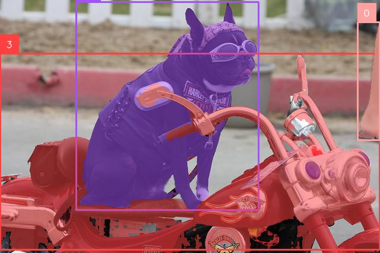

# Zero shot object segmentation with TROLO and SAM-HQ



 This example will show you how you can enforce `trolo` object detector with [SAM-HQ](https://github.com/SysCV/sam-hq) to get segmentation masks. `SAM-HQ` is a variant of  [SAM](https://segment-anything.com/) from meta which has capability of zero shot object segmentation from prompt. SAM prompt can be points with class ids or boxes. In this example, we will use boxes as prompt for sam-hq.

  
## Features  
- **Object Detection**: Detect objects in image using a specified detection model.  
- **Instance Segmentation**: Segment each object from `SAM` by providing detected objects

  
## Installation:  
  
- Setup python environment and activate it [optional]  
 ```shell  
  python3 -m venv venv  
 source venv/bin/activate 
 ``` 
 - Install required dependencies  
```shell  
  pip install trolo supervision segment-anything-hq requests  
 ```  
 
## How It Works  
1. The script loads a detection model using `DetectionPredictor` from `trolo`  
2. It detect objects in the image
3. Boxes information will be used to prompt `SAM` model for segmentation task
4. The processed frame is either visualized in real-time or written to an output image file (if specified).  
  
## Command-Line Arguments  
  
| Argument          | Type     | Default     | Description                                                                 |  
|--------------------|----------|-------------|-----------------------------------------------------------------------------|  
| `--image_path`     | `str`    | (Required)  | Path to the input image file.                                               |  
| `--model_name`     | `str`    | `dfine-m`   | Name of the detection model to use.                                         |  
| `--sam_model_name`     | `str`    | `vit_b`   | Name of the sam model to use.                                         |  
| `--output_path`    | `str`    | `None`      | Path to save the output annotated image.                                    |  
| `--vis`            | `bool`   | `True`      | Whether to visualize the annotated frames in real-time.                     |  
| `--conf_threshold` | `float`  | `0.35`      | Confidence threshold for filtering detections.                              |  
  
### Example Usage  
  
#### Basic Usage  
```bash  
python trolo_sam.py --image_path "input.jpg"  
```  
 